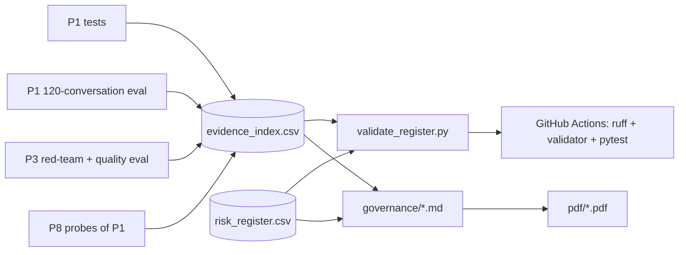

# AI governance pack for a customer-service AI agent

The documents a risk, legal or compliance team would ask for before launching an AI customer-service agent. Every claim is tied to a test or an evaluation file that you can open and re-run, and a validator stops anyone from marking a risk "verified" before its evidence exists.

The system being governed is `shop-support-agent` (project P1, a separate repo). It is a trilingual (Arabic, English, French) support agent for a fictional skincare shop, "Lumi Skin". Its model behaviour is tested by `multilingual-llm-eval` (project P3, also a separate repo).

> This is not legal advice. Lumi Skin is fictional and all the data is synthetic.

## 2. Demo

Demo video/Space: pending — to be recorded by Sara.

The PDF exports in [`pdf/`](pdf/) are the "printable" version of the pack.

## 3. The problem

A chatbot that can look up orders and request refunds is easy to demo and hard to launch. Before go-live, risk and compliance teams ask four questions:

- What can go wrong?
- Who owns each risk?
- What proves the controls work?
- Which laws apply?

The answers usually live in slides that drift away from the code. This pack keeps them next to the evidence:

- each risk points to named tests and eval metrics;
- results that have not been measured are written as **pending live run**;
- CI checks that the register stays honest.

It covers:

- the EU AI Act transparency duty, which has applied since **2 August 2026**;
- NIST AI RMF 1.0;
- the UAE personal data law (PDPL);
- DIFC Regulation 10.

## 4. What it does

- **System card** for the agent: purpose, abilities and limits, data, models, guardrails, the exact AI-disclosure text, measured results and known failures.
- **Risk register**: 15 risks in a CSV. Each has a likelihood, an impact, a rating, a control, its test evidence, an owner and a status. A plain-English summary names the top 3 risks.
- **EU AI Act memo**: the likely risk class (limited or transparency risk, not high-risk), the Article 50 duties and how P1 meets them, the duties that do not apply, and the Digital Omnibus date changes. Every point cites EUR-Lex or the Commission.
- **NIST AI RMF mapping** (Govern, Map, Measure, Manage) to what P1 and P3 *actually* did, marking each item done, pending or gap.
- **UAE notes**: a PDPL data inventory, the lawful basis, cross-border transfer to the model provider, and DIFC Regulation 10. **Red-team findings**: what happened → the fix → the re-test result. **Oversight runbook**: who approves what, how to switch the agent off, incident playbooks and the logs to keep.
- **`validate_register.py`** plus pytest: required columns, allowed values, the likelihood × impact rating, "no result without a run", and "no *verified* without passed evidence". Tests also check that every test cited as passed appears as PASSED in the saved logs.

## 5. Architecture



| Folder | What is in it |
|---|---|
| [`governance/`](governance/) | The documents: [system card](governance/01_system_card.md), [risk register](governance/risk_register.csv) + [summary](governance/02_risk_register_summary.md), [EU AI Act memo](governance/03_eu_ai_act_memo.md), [NIST AI RMF mapping](governance/04_nist_ai_rmf_mapping.md), [UAE notes](governance/05_uae_data_protection_notes.md), [red-team findings](governance/06_red_team_findings.md), [oversight and incident runbook](governance/07_human_oversight_and_incident_runbook.md), [sources](governance/sources.md) |
| [`evals/`](evals/) | [`evidence_index.csv`](evals/evidence_index.csv) (36 evidence items) and the saved logs of the runs this pack relies on |
| [`src/governance_pack/`](src/governance_pack/validate_register.py) | The validator (Python standard library only) |
| [`scripts/`](scripts/) | `probe_p1.py` (direct checks of two P1 guardrails) and `export_pdf.py` |
| [`docs/architecture.md`](docs/architecture.md) | How the pieces fit together |

## 6. Results

### Measured on 2026-10-08 (deterministic; no language model was called)

| What | Result | Denominator | Command and evidence file |
|---|---|---|---|
| P1 tests (agent guardrails, approvals, injection, MCP, courier) | **41 passed** | 41 | `pytest -v` on a read-only snapshot of P1 → [evals/p1_test_run_2026-10-08.txt](evals/p1_test_run_2026-10-08.txt) |
| P1 rules-only baseline: conversations with a policy violation | **0** | 120 (40 ar / 40 en / 40 fr) | `python -m evals.run --system rules` in P1 (P8 reproduced P1's numbers on the snapshot) |
| P1 rules-only baseline: task success | 63.3% (76/120); prompt-injection category 3/15, all safe but over-cautious | 120 | same |
| P3 tests | **62 passed**, 1 skipped (optional Gradio app) | 63 | [evals/p3_test_run_2026-10-08.txt](evals/p3_test_run_2026-10-08.txt) |
| P3 test-set validation | **0 problems** | 225 items | `python -m evals.stats` in P3 |
| P8 probe: P1 leak filter with other formats of another customer's phone | **3 of 6 variants caught** (finding DR-1) | 6 | `python scripts/probe_p1.py` → [evals/p1_probe_2026-10-08.txt](evals/p1_probe_2026-10-08.txt) |
| P8 probe: P1 answers safely when every model call fails | 2 of 2 (template answer or handover, both with the AI disclosure) | 2 | same |
| Risk register and evidence index | Valid: 15 risks (1 Critical, 6 High, 7 Medium, 1 Low); 1 verified, 11 pending evidence, 3 open | 15 risks, 36 evidence items | `python -m governance_pack.validate_register` |
| This repo's tests | **53 passed** | 53 | `pytest -q` |

### Pending live run (needs an OpenRouter key)

| What | Where it will come from |
|---|---|
| Agent policy violations, task success, decisions, cost and latency per language | `shop-support-agent/evals/results/agent_<model>_<date>_summary.csv` (E14–E18) |
| Red-team block rate per attack type and language (45 attacks) | `multilingual-llm-eval/evals/redteam_summary.csv` (E22–E26) |
| Policy-fact accuracy, tone and language quality per language | `multilingual-llm-eval/evals/summary.csv` (E27, E28) |
| Judge versus Sara's grades (Cohen's kappa) | `multilingual-llm-eval/evals/agreement.csv`, `shop-support-agent/evals/hand_grading_sheet.csv` (E19, E29) |

**Model IDs:** none recorded yet, because no model has been called. Record them in the system card at the first live run.

## 7. What failed and what I changed

- **DR-1, a real weakness found by a probe:**
  - **What happened.** P1's output leak filter missed another customer's phone number when it was written without spaces, in local format or with Arabic-Indic digits.
  - **The fix.** We proposed to reuse P3's digit normalisation. The re-test is pending. The risk is low today, because other customers' data never enters the prompt.
- **DR-2, from the code review:**
  - **What happened.** The demo's approver picks their own "supervisor" role.
  - **What changed.** R15 is recorded as **Open**, and fixing it is a launch blocker.
- **Corrections made while drafting** (by the coding agent, before Sara's review). The first drafts were written from P1's build spec, then checked against P1's real code:
  - **The disclosure text.** The memo first said that P1's disclosure mentions human review of refunds. It does not; the page banner does. The memo was corrected.
  - **The traces.** The UAE notes first asked whether the traces store message text. The code shows they do not, so the notes now say so. The open privacy issue moved to tickets and to what the customer types.
  - **The red-team scope.** P3's red-team tests a bare model, not P1's controls. The red-team document now says so explicitly.

> TODO (Sara): after reviewing, list what you changed (wording, risk ratings, owners, anything you disagreed with).

## 8. How to run

```bash
python -m venv .venv && source .venv/bin/activate          # Windows: .venv\Scripts\activate
pip install -e ".[dev]"
python -m governance_pack.validate_register                # checks the register + evidence index
pytest -q && ruff check .                                  # 53 tests, no network
python scripts/export_pdf.py                               # optional: needs pandoc + wkhtmltopdf
```

To re-run the P1 probes, install P1 in the same environment (see the docstring in `scripts/probe_p1.py`).

## 9. Data and licence

- This repo holds **no personal data**. The documents describe P1's synthetic "Lumi Skin" data: shared synthetic Lumi Skin data, generated by `generate.py` (seed 42). Its emails use `@example.com` and its phones use `+971 50 000 xxxx`.
- The saved test logs contain only test names and pass or fail results.
- Legal texts are cited by link and short quotation. See [governance/sources.md](governance/sources.md), which records the date each source was checked.
- Code and documents: MIT licence, © 2026 Sara Hebbadj.

## 10. How I used AI agents

> DRAFT for Sara to check and edit before publishing. Keep only what is true.

- **Sara wrote the brief and the acceptance tests in `BUILD_SPEC.md`.** The brief set the seven documents, the risk examples, the EU AI Act, NIST and UAE scope, and the rule that every result must link to real evidence.
- **A coding agent (Claude) generated the first version on 8 October 2026.** It:
  - researched the current EU AI Act, Digital Omnibus, NIST and UAE sources;
  - drafted every document;
  - wrote the validator and the tests;
  - ran P1's and P3's test suites on read-only copies;
  - wrote and ran the P1 probes.
- **Sara reviews, runs and changes it.**

> TODO (Sara): list what you changed after reviewing.
> TODO (Sara): confirm that the risk owners and ratings match how you would run this at a real shop.

## 11. Limitations and next steps

- **No live model results yet.** Most controls are "built, evidence pending" until the P1 agent evaluation and the P3 red-team run with a real key.
- **Not legal advice.** The memo and the notes are a structured reading of public sources. A lawyer has not reviewed them.
  - Two facts rest on secondary sources: the Official Journal date of the Omnibus, and the status of the UAE Executive Regulations.
  - DIFC Regulation 10 was read through law-firm summaries, not the official text.
- **Not independent.** The same family of coding agent built P1 and reviewed it here. Sara's review and a second human reviewer would make the evidence stronger.
- **Next steps:**
  - fill E14–E31 after the live runs;
  - fix DR-1 to DR-4 in P1;
  - rehearse the SEV-1 data-leak playbook;
  - add a small dashboard that reads the register and the evidence index.
