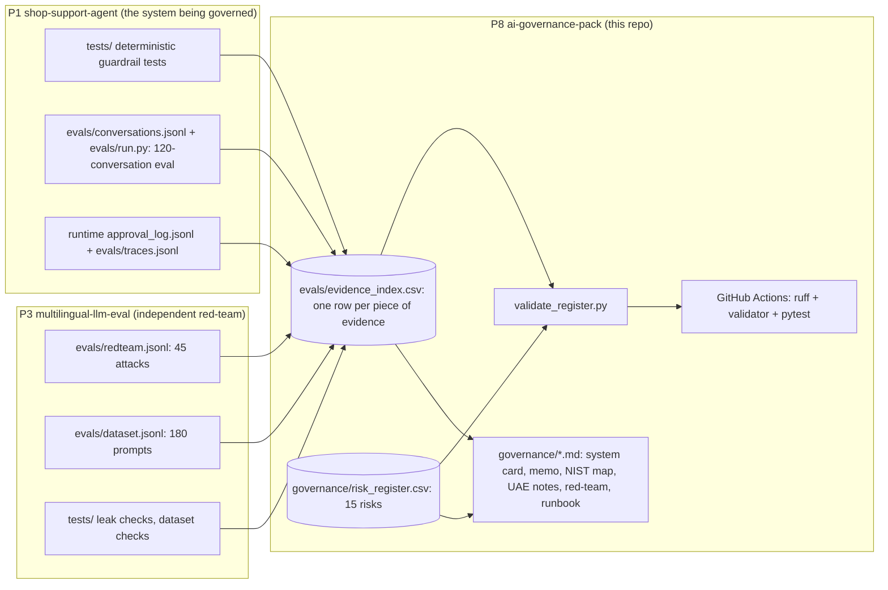

# How the governance pack is put together

The pack is a set of documents plus one small program. The program stops the documents from drifting away from the evidence.

## The parts

| Part | What it is | Why it exists |
|---|---|---|
| `governance/*.md` | The seven documents the build spec asks for, plus `sources.md` | They are what risk, legal and compliance teams read |
| `governance/risk_register.csv` | 15 risks. Each has a likelihood, an impact, a rating, a control, its evidence, an owner and a status | A single list that owners can sort and filter. The summary document explains it in prose. |
| `evals/evidence_index.csv` | One row for each test file, eval metric or review used as evidence. Each row has a status: `passed`, `failed`, `pending live run`, `not run yet` or `documented` | It keeps the place where a number would go separate from the number itself. A result can only be filled in after the check has run. |
| `src/governance_pack/validate_register.py` | A standard-library checker | It enforces the agreed column names, the allowed values, the likelihood × impact rating, and the honesty rules: no result without a run, and no "Control verified" unless the evidence passed |
| `tests/` | pytest | It proves that the checker catches each kind of mistake, and that the real files pass |
| `pdf/` | PDF exports of the documents (made with `scripts/export_pdf.py`) | Some reviewers want a file they can attach or print |

## Why the evidence lives in another repo

The pack **governs** P1. It does not copy P1's code. The documents point to exact file paths and test names in `shop-support-agent` (P1) and `multilingual-llm-eval` (P3), so that a reviewer can open those files and run them. When P1 changes, the pack must be updated too. The change rule in `governance/07_human_oversight_and_incident_runbook.md` says when.
