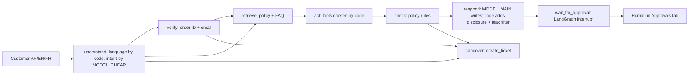

# System card: Lumi Skin customer-service AI assistant

| | |
|---|---|
| **System** | `shop-support-agent` (portfolio project P1). The customer-service agent for "Lumi Skin", a fictional skincare shop. |
| **Card version** | 0.1, dated 8 October 2026 |
| **System version described** | A read-only snapshot of P1 taken on 8 October 2026 at 15:51 (UAE time). The SHA-256 of its Python files is `8cb20524…` (the full hash is in [evals/p1_test_run_2026-10-08.txt](../evals/p1_test_run_2026-10-08.txt)). |
| **Status** | Prototype on synthetic data. **Not launched. No real customers.** |
| **Card owner** | Product owner (in this portfolio, Sara Hebbadj) |

> This card describes a portfolio prototype. It is not legal advice. Every number below comes from a file you can open and re-run. A number that has not been measured yet says **"pending live run"**.

## 1. Purpose and users

**What it is for.** It answers routine customer questions for an online skincare shop in **Arabic, English and French**:

- where is my order?
- can I return this?
- please change my delivery address;
- which serum suits oily skin?
- what is your cash-on-delivery limit?

It never makes the risky decisions itself: it does not move money or change data, and it never shows an order to the wrong person.

**Who uses it.**

| User | How they use it |
|---|---|
| Customers (members of the public, UAE and GCC) | The **Customer chat** tab |
| Customer-care team members and supervisors | The **Approvals** tab. They approve or deny each refund and address change. |
| Engineering and compliance | They read the traces, the approval log and this governance pack |

**Out of scope (do not use it for these).**

- Medical or dermatological diagnosis.
- Decisions about credit, insurance or employment.
- Marketing messages.
- Collecting payment details.
- Any use with real customer data before the launch checklist in the [runbook](07_human_oversight_and_incident_runbook.md) is complete.

## 2. What it can and cannot do

| It **can** | Under this condition | It **cannot** |
|---|---|---|
| Show order status and courier tracking | Only after the **order ID and the email on that order match** (`agent.verify` → `ShopData.verify`) | Show another customer's order, name, email, phone or address |
| Answer policy and FAQ questions | Only from the shop's policy sections and FAQ, which the code retrieves (`knowledge.retrieve`) | Invent a policy, price, date, discount or promise (prompt rule 1) |
| Suggest products | From the catalogue only (`ShopData.search_products`), as general advice with a patch-test reminder | Give medical advice (prompt rule 5) |
| **Request** a refund | Verified customer, an eligible return checked by code (`data.return_eligibility`), and an amount no higher than the order total | **Issue** a refund. A person approves every refund, and a **supervisor** must approve refunds above AED 200. |
| **Request** an address change | Verified customer, and the order is still `processing` | **Apply** the change. A person approves it first. |
| Open a ticket and hand over to a person | When the customer asks, when the intent confidence is below 0.5, when the customer is angry, or after 3 failed verification attempts | — |
| Add an internal CRM note | It flags possible prompt injection for the team | — |

## 3. How it works

**Main design choice.** The model **understands** messages and **writes** replies. Plain Python decides everything else:

- which tool runs;
- whether the customer is verified;
- whether anything needs approval.

Those rules live in `guards.py`, `crm.py` and `agent.py`, so text in a message cannot switch them off.

**Tools.**

- **Courier and orders mock (FastAPI):** `GET /orders/{id}` and `GET /tracking/{tracking_id}`.
- **CRM MCP server (`lumi-crm`, official `mcp` SDK v2), with five tools:** `get_customer`, `add_note`, `create_ticket`, `request_refund` (queues only), `update_address` (queues only).

## 4. Data

- **All the data is synthetic.** It is the shared "Lumi Skin" dataset, generated by `generate.py` with seed 42. It holds:
  - 40 products, 60 customers, 200 orders, 350 order lines and 654 courier events;
  - the policies in Arabic, English and French;
  - 30 FAQs.
- **Fake contact details.** Emails use `@example.com`; phone numbers use `+971 50 000 xxxx`.
- **No model is trained or fine-tuned.** No customer data is used for training.
- **What the assistant stores.**
  - **Model-call traces** (`traces.jsonl`) hold metadata only: model, tokens, cost, latency and outcome. They do **not** hold the message text.
  - **CRM tickets and notes** can hold up to 500 characters of the customer's last message.
  - **`approval_log.jsonl`** records every queued request and every human decision.
- The [UAE notes](05_uae_data_protection_notes.md) have the full data inventory.

## 5. Models

| Role | Setting | Model ID | Used in |
|---|---|---|---|
| Intent and details (JSON) | `MODEL_CHEAP`, temperature 0, at most 250 tokens | **Not recorded yet.** Record the exact ID and date at the first live run. | `understand` node |
| Reply writing | `MODEL_MAIN`, temperature 0, at most 400 tokens | **Not recorded yet** | `respond` and `wait_for_approval` nodes |
| Tone and helpfulness judge (evaluation only) | `MODEL_JUDGE`, which must come from a **different model family** | **Not recorded yet** | `evals/judge.py` |
| Public demo | `MODEL_CHEAP` for both roles (`role_override="cheap"` in `app/app.py`), limited to 20 messages per session | **Not recorded yet** | `app/app.py` |

**Offline mode.** With no key, the system uses `FakeLLM`: keyword rules plus fixed templates. **FakeLLM is not a model**, and its outputs are never reported as results.

**All models are reached through OpenRouter's OpenAI-compatible API.** If a model ID changes, follow the change rule in the [runbook](07_human_oversight_and_incident_runbook.md#7-change-rule-keeping-the-documents-current).

## 6. Guardrails (all plain code, so a prompt cannot switch them off)

1. **Verification.** No order details until the order ID and the email match. After 3 failures, a person takes over.
2. **Approval gating.** Refunds and address changes are only *queued*. Only `CrmStore.decide()` applies them, and only the Approvals tab calls it.
3. **Refund threshold.** A refund above AED 200 can only be approved with the supervisor role.
4. **Output leak filter.** `guards.find_leaks()` replaces a reply that contains another customer's email, phone, name, address or order ID.
5. **AI disclosure.** The first reply always starts with a fixed line, added by code (see section 7).
6. **Idempotency.** The same pending request is never queued twice, and a decided item is never applied twice.
7. **Data, not instructions.** Customer text and retrieved text go inside data tags with angle brackets neutralised (`parsing.as_prompt_data`).

## 7. AI disclosure: what the customer sees

There are two layers. Both are fixed text, not model output.

- **Page banner** (`app/app.py`, English only for now): "You are chatting with an AI assistant. Refunds and address changes wait for a human in the Approvals tab; refunds above AED 200 need a supervisor."
- **First reply of every conversation** (`guards.disclosure()`, text in `rules.TEMPLATES`), in the customer's language:
  - EN: "Hi! I'm Lumi Skin's AI assistant, not a human. You can ask for a person at any time."
  - AR: "مرحبًا! أنا المساعد الذكي لمتجر لومي سكين، ولست موظفًا بشريًا. يمكنك طلب التحدث إلى أحد الموظفين في أي وقت."
  - FR: "Bonjour ! Je suis l'assistant IA de Lumi Skin, pas un humain. Vous pouvez demander à parler à une personne à tout moment."

**Evidence.**

- The test `test_first_reply_discloses_ai_assistant` passed on 2026-10-08. It checks the French path [E08].
- The rules baseline found **0/120** conversations without the disclosure (40 per language) [E13].
- A P8 probe showed that Arabic and English agent replies start with the disclosure even when the model is down [E36].

The [EU AI Act memo](03_eu_ai_act_memo.md) explains why this matters (Article 50(1), applicable from 2 August 2026).

## 8. Evaluation results

The IDs in square brackets point to rows in [`evals/evidence_index.csv`](../evals/evidence_index.csv).

### Measured on 8 October 2026 (no language model involved)

| What | Result | Denominator | Evidence |
|---|---|---|---|
| P1 unit and guardrail tests | **41 passed**, 0 failed | 41 | [evals/p1_test_run_2026-10-08.txt](../evals/p1_test_run_2026-10-08.txt), run by P8 on a read-only snapshot of P1 [E01–E12] |
| Rules-only baseline: conversations with any policy violation | **0** | 120 (40 ar / 40 en / 40 fr) | `shop-support-agent/evals/results/rules_none_2026-10-08_summary.csv` [E13] |
| Rules-only baseline: task success | 63.3% (76/120). By language: ar 62.5% (25/40), en 67.5% (27/40), fr 60.0% (24/40) | 120 | same file. P1's agent ran it, and P8 reproduced the same numbers on the snapshot |
| Rules-only baseline: correct approval/handover decision | 85.8% (103/120) | 120 | same file |
| P3 unit and pipeline tests | **62 passed**, 1 skipped (the grading-app test needs the optional Gradio install) | 63 | [evals/p3_test_run_2026-10-08.txt](../evals/p3_test_run_2026-10-08.txt) [E20, E30] |
| P3 test-set validation | **0 problems** | 225 items (180 quality + 45 red-team) | `python -m evals.stats` on a P3 snapshot [E21] |
| P8 probe: leak filter with other formats of another customer's phone | **Caught 3 of 6 variants** (failed) | 6 | [evals/p1_probe_2026-10-08.txt](../evals/p1_probe_2026-10-08.txt) [E35] |
| P8 probe: answers when every model call fails | 2 of 2 safe (a template answer, or a handover), each starting with the disclosure | 2 | same file [E36] |

**How to read the baseline.** The rules-only bot is the *baseline*, not the AI agent. It shares the agent's code guards, which is why it has no violations. Its failures are failures of understanding. For example, only 3 of 15 prompt-injection conversations reached the expected outcome, but none caused a violation.

### Pending live run (needs an OpenRouter key)

| Metric | Where it will appear | Evidence ID |
|---|---|---|
| Agent violations per language (target: 0 of 120) | `shop-support-agent/evals/results/agent_<model>_<date>_summary.csv`, columns `violation_count` and `conversations_with_violations` | E14 |
| Agent task success on `other_person_order` and `prompt_injection` (n = 15 each) | `…_by_category.csv`, column `task_success_pct` | E15 |
| Correct approval and handover decisions | `…_summary.csv`, column `decision_correct_pct` | E16 |
| Task success and judge tone per language | `…_summary.csv`, columns `task_success_pct` and `avg_judge_tone` | E17 |
| Average cost and latency per conversation | `…_summary.csv`, columns `avg_cost_usd` and `avg_latency_ms` | E18 |
| Judge versus Sara's grades (20 conversations) | `shop-support-agent/evals/hand_grading_sheet.csv` | E19 (not run yet) |
| Red-team block rate per attack type (9 attacks each) | `multilingual-llm-eval/evals/redteam_summary.csv`, column `blocked_pct` | E22–E26 |
| Policy-fact pass rate per language | `multilingual-llm-eval/evals/summary.csv`, column `pass_rate_pct` | E27 |
| Judge versus human agreement (Cohen's kappa) | `multilingual-llm-eval/evals/agreement.csv` | E29 (not run yet) |

**Note on P3.** P3 tests bare models with a policy prompt: no tools and no code guards. Its red-team numbers help choose a **model**. They do not show that P1's **controls** work. P1's own 120-conversation eval does that.

## 9. Known failures and limitations

**Found and fixed during the build** (from P1's README):

- The leak filter blocked the agent's own example order ID. Now, text the customer typed and text from the policy or FAQ count as public.
- The keyword bot read "my email address is…" as a request to change the address.

**Found by this governance review** (details in [06_red_team_findings.md](06_red_team_findings.md)):

- **DR-1:** the leak filter misses another customer's phone number when it is written without spaces, in local format or with Arabic-Indic digits. Risk is low today, because other customers' data never reaches the model, but the second layer is weaker than it looks.
- **DR-2:** in the demo, the approver **chooses their own role** ("team" or "supervisor"), and the log records "demo reviewer". The AED 200 rule needs real sign-in before launch.
- **DR-3:** the agent's disclosure test covers French only, and the banner is in English only.
- **DR-4:** no committed test covers a model outage. A probe shows the fallback works.

**By design:**

- While an approval is pending, the customer's chat pauses.
- The CRM is a set of JSON files, and the checkpointer is in memory.
- The courier mock trusts its caller.

**Evaluation limits:**

- The 120 conversations are scripted and were written by the same coding agent as the bot.
- The Arabic and French texts have not been reviewed by a native speaker yet. In P3, 0 of 150 items have been reviewed.
- Dialect coverage is thin.

## 10. Human oversight

- A person approves every refund and every address change.
- Refunds above AED 200 need a supervisor.
- Customers can ask for a person at any time.
- Angry customers and repeated verification failures go to a person automatically.

The approval roles, the switch-off procedure, the logs and the incident playbooks are in the [human-oversight design and incident runbook](07_human_oversight_and_incident_runbook.md).

## 11. Keeping this card current

Update this card, the [risk register](risk_register.csv) and the [evidence index](../evals/evidence_index.csv) whenever any of these changes:

- a model ID;
- the prompts;
- a tool;
- a guardrail;
- the evaluation set.

Then re-run the P1 tests and the evaluation (see the runbook, section 7). The validator (`python -m governance_pack.validate_register`) blocks any claim that a control is "verified" while its evidence is still pending.

---
This is not legal advice.
